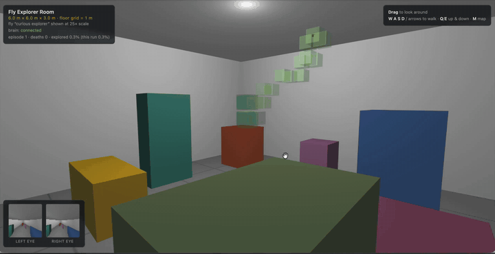

# Fly Explorer

A simulation of a fly — "curious explorer" — whose behavior is generated
by a neural simulation running on the real FlyWire FAFB connectome
(~139k neurons, ~3.4M filtered connections). The 3D room, the fly's body
and its eyes live in the browser; the brain lives in Python; they talk
over WebSocket. Nothing in the environment scripts behavior: every
movement emerges from connectome activity.

- **SPEC.md** — Fly Brain + Data Specification v0.1 (the governing spec)
- **PROTOCOL.md** — the brain ⇄ environment wire format (v2)

## Demo

Emergent phototaxis: with body speeds rescaled to what the sensorimotor
loop can process, the connectome-driven fly climbs toward the ceiling
light and circles it — no scripted behavior anywhere.



Full-quality video: [public/fly-explorer-demo.mp4](public/fly-explorer-demo.mp4)

```
room/        the ENVIRONMENT — TypeScript + Vite + raw WebGL
brain/       the BRAIN — Python: FlyWire graph + neural simulation
data/        raw FlyWire Codex exports (.csv.gz, read directly)
brain_data/  preprocessed brain dataset (generated by npm run preprocess)
```

## Architecture

```
┌────────────────────────────────┐
│ WebGL application (room/)      │
│ room · fly body · eye cameras  │
│ collision · observer/mapper    │
└──────────────┬─────────────────┘
               │  binary observation: eye images, angular velocity,
               │  privileged telemetry (episode, alive, position...)
               ▼
        WebSocket  ws://localhost:8765
               │
               ▼
┌────────────────────────────────┐
│ Python brain server            │
│  FlyWire graph      preprocess/ + brain_data/       │
│  neuron state       runtime/brain.py                │
│  neural simulation  runtime/dynamics.py (100 Hz)    │
│  sensory encoder    runtime/sensory_encoder.py      │
│  motor decoder      runtime/motor_decoder.py        │
└──────────────┬─────────────────┘
               │  {forward, yaw, pitch, vertical, lateral, brake, escape}
               ▼
┌────────────────────────────────┐
│ WebGL fly actor                │
└────────────────────────────────┘
```

The brain hosts the WebSocket server; the room connects to it, streams one
binary observation per frame, and applies the latest motor command. The
loop is asynchronous — the environment never blocks on the brain, and with
no brain connected the fly receives zero commands and hovers. The brain
integrates on its own fixed 10 ms clock (an accumulator turns frame time
into 0..N neural steps), resets its state when the episode changes, and
stops advancing while the fly is dead. Death triggers a brain-requested
respawn after a short pause, so episodes cycle continuously.

## Run

```sh
pip install -r brain/requirements.txt

npm run preprocess   # once (and after changing data/ or preprocess config):
                     # raw Codex .gz -> brain_data/ + stage-1 validation report
npm run validate     # optional: offline validation (stages 2-3, see below)

# terminal 1 — the brain
npm run brain        # = python3 -m brain.server.server

# terminal 2 — the room
cd room && npm install   # first time only
npm run dev              # http://localhost:5173
```

HUD: brain link status, `episode · deaths · explored %`, and two live
previews of exactly what each eye sends to the brain. Spectator controls:
drag to look, WASD/arrows to walk, Q/E down/up, **M** toggles the 3D map.
Console: `window.flyexplorer` exposes `env`, `brain`, `camera`, `mapper`.

## The world

- Room: 6 × 6 × 3 m, solid walls/floor/ceiling, no doors.
- Coordinates: X = left/right, Y = up/down, Z = forward/back;
  origin = center of the floor (0, 0, 0).
- 7 obstacle boxes (B1–B7 in `room/src/env/Room.ts`), asymmetric, each a
  distinct color; room surfaces are neutral grays.
- Lighting: fixed ambient + one static ceiling light. No shadows,
  reflections, animated lights or textures.

## The fly

- Body 3 × 2 × 2 mm, collision radius ~1.5 mm (true scale in physics;
  rendered magnified via `visualScale`, default 25×).
- Starts at (0, 1.5, 0), zero velocity, random yaw.
- Full 3-axis flight (`room/src/env/Fly.ts`): signed thrust along forward
  (negative = backward), sideways strafe, vertical lift, yaw/pitch torque
  -> angular rate -> angle, linear drag 0.98 / angular drag 0.95 per
  60 Hz tick (frame-rate independent), plus a brake command that damps
  velocity — the fly can reverse, change direction, stop and restart.
- Escape maps to a retreat burst (backward + upward), mirroring the
  Giant Fiber jump away from a looming stimulus.
- Limits (experimental, keep consistent across runs): max forward
  0.5 m/s, vertical 0.3 m/s, yaw rate 500°/s, pitch ±80°. Speeds are
  sized to the sensorimotor loop: ~2-5 cm traveled per ~50-100 ms neural
  reaction (indoor Drosophila cruise is ~0.2-0.7 m/s).
- Collisions: all 13 solids; by impact speed — < 0.1 m/s soft contact,
  < 0.35 m/s minor collision, above lethal. A full-speed impact kills;
  braking before surfaces is what keeps the fly alive.
- Vision: two eyes (~1 mm apart, 160° FOV, 64 × 64 RGBA each), rendered
  offscreen; the fly never sees its own body, and the brain never sees
  the spectator camera.
- The fly carries NO behavior. All movement comes from the brain.

## Room app layout

```
room/src/
  render/        pure WebGL: Renderer (offscreen targets, translucent pass,
                 growable meshes), shaders, box geometry, mat4 math
  env/           the environment (simulation) — no UI, no network
    types.ts     Action / Observation / telemetry types
    Room.ts      shell + boxes B1–B7, bounds + sphere collision
    Fly.ts       body, 3-axis flight physics, caps, collision severity
    vision.ts    FlyEyes: two offscreen eye cameras + pixel readback
    Environment.ts  step(action, dt) / reset() facade, episode counter
  link/          BrainLink: WebSocket client — binary observations out,
                 motor messages in, auto-reconnect, zeroed on link loss
  observer/      Mapper + MapLayer (see below)
  ui/            spectator-only: first-person Camera + Input
  main.ts        wires it all, frame loop, eye previews + HUD stats
```

The environment is deliberately shaped like an RL environment
(`reset()` / `step(action, dt) -> observation`) so the brain side can wrap
it in a training loop.

## Brain (python)

Implements SPEC.md v0.1 (§41 layout):

```
brain/
  config/brain.json        all modeling assumptions: transmitter signs, dt,
                           decay, gains, vision grid — config, not code
  preprocess/              raw Codex .gz -> brain_data/ (SPEC §29)
    load_connections.py    filtered graph (syn_count >= 5 -> ~3.4M edges)
    load_neurons.py        annotations joined per neuron
    load_transmitters.py   configured transmitter signs per edge
    build_brain.py         pipeline + population selection + validation report
  runtime/
    dynamics.py            sparse CSR rate model: tanh(decay*a + s*(W@a) + ext)
    sensory_encoder.py     eye features -> external input (see Vision pipeline)
    motor_decoder.py       output populations -> the 7 motor values
    diagnostics.py         SPEC §25 diagnostics
    brain.py               FlyBrain: initialize/reset/step (own 100 Hz clock)
  server/server.py         protocol v2 WebSocket server + episode loop
  validate_dynamics.py     offline validation, stages 2-3
brain_data/                preprocessed dataset (generated)
```

### Vision pipeline

Each eye's 64 × 64 RGBA render is projected to a 16 × 16 luminance grid,
then two feature streams stimulate real FlyWire populations:

- **luminance + temporal difference** -> photoreceptors by side
  (4,955 L / 4,751 R);
- **looming** (rectified radial-expansion estimate — positive when a
  surface approaches) -> **LC4 + LPLC2** by side (104 / 210 neurons),
  the biological looming detectors that drive the Giant Fiber escape
  through the connectome itself.

### Motor boundary

Descending-neuron populations, all real FlyWire families; the axis
assignment is a declared v0.1 modeling assumption (activity is
tanh-signed, so one population per axis yields both directions):

| output | population | count |
|---|---|---|
| yaw | all descending, right − left asymmetry | 1,297 |
| forward / backward | DNp (posterior, flight motor) | 326 |
| vertical | DNa (anterior, steering) | 52 |
| lateral | DNb | 41 |
| brake | DNg | 847 |
| escape | DNp01 (Giant Fiber) | 2 |
| pitch | empty in v0.1 (decodes to 0) | — |

### Validation (`npm run validate`)

- Stage 2 — dynamics: stimulate, verify no NaN / saturation / collapse,
  activity decays when the stimulus is removed.
- Stage 3 — sensory causality: left vs right stimuli produce different
  descending activity.
- Stage 3b — looming: a growing square drives escape ~7× harder than the
  same square held static.
- Determinism: identical inputs -> bit-identical outputs (SPEC §36).

No learning in v0.1: weights are constant within and across episodes.

## Observer / mapper

`room/src/observer/` watches the fly from outside using privileged true
coordinates — strictly one-way, nothing ever flows back to the brain
(SPEC §40):

- `Mapper.ts` — 0.25 m voxel grid over the room (space inside boxes is
  excluded from the denominator), cumulative + per-episode coverage, and
  a death log (episode, position, sim time, contacts).
- `MapLayer.ts` — draws the 3D exploration map in the spectator view:
  discovered voxels as translucent cubes colored by height, deaths as
  red markers. Toggle with **M**. Never rendered into the eyes.

The fly's task is to discover the whole room; coverage % is the score.
Getting meaningful exploration is an experimental result, not an
implementation requirement (SPEC §43).

## Tuning the experiments

The main knobs, all in `brain/config/brain.json` unless noted:

- `simulation`: `decay`, `inputScale`, `globalWeightScale` — network
  excitability and propagation strength.
- `vision`: `luminanceGain`, `temporalGain`, `loomingGain`.
- `motor`: per-axis gains + `smoothing`.
- Body constants (speed caps, drag, lethal impact threshold) at the top
  of `room/src/env/Fly.ts`.

After changing `preprocess` config or population selection, re-run
`npm run preprocess`; runtime config changes only need a brain restart.
